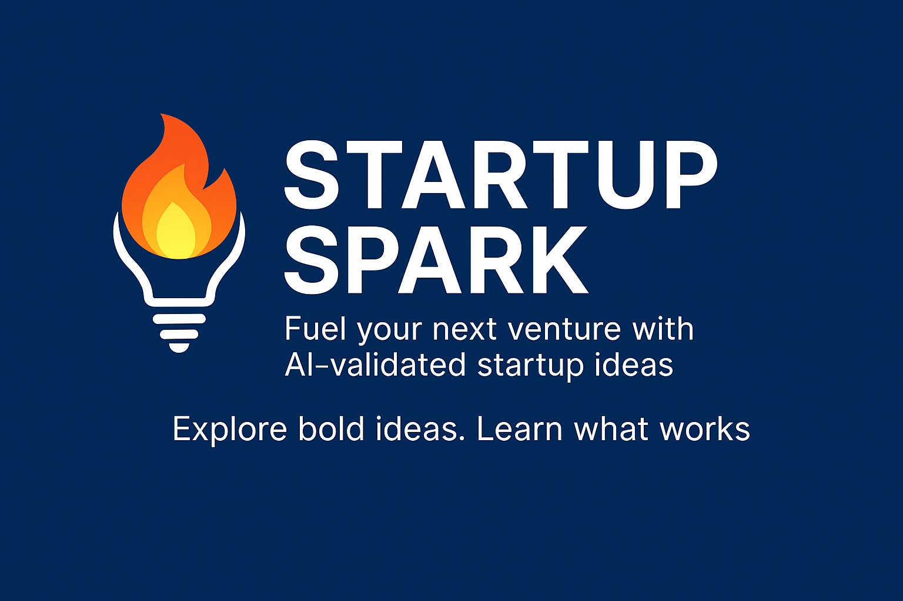

# 🚀 Startup Spark


[](https://streamlit.io/)
[](https://www.docker.com/)
[](https://huggingface.co/spaces/leana001/munna)
[](https://www.python.org/)
[](https://huggingface.co/google/flan-t5-large)
[](https://github.com/usshis16/startup-spark/stargazers)
[](https://github.com/usshis16/startup-spark/issues)
[](LICENSE)



**Fuel your next venture with AI-validated startup ideas.**  
*Built with Streamlit + Docker. Deployed on Hugging Face Spaces.*


[](https://huggingface.co/spaces/leana001/munna)
[](https://streamlit.io/)
[](https://www.docker.com/)
[](https://github.com/usshis16)

---

## ✨ What is Startup Spark?

Startup Spark is an AI-powered idea generator for:
- 🧠 Founders seeking inspiration
- 👩‍🏫 Educators teaching innovation
- 🧪 Builders prototyping fast, validated concepts

🔍 Generates startup ideas tailored to your topic and audience

It makes your messaging sharper and more discoverable too—great for SEO and users who want results, fast.

---

## 🔍 Features

- 🪄 Zero-input UX: just describe your focus area
- ⚡ Fast, prompt-driven idea generation
- 🧠 Backed by a transformer-based LLM (Flan-T5 Large)
- 🌐 Fully containerized + live on Hugging Face Spaces

---

## 💻 Live Demo

👉 Try it here: [Startup Spark (Hugging Face)](https://huggingface.co/spaces/leana001/munna)


---

## 🧰 Tech Stack

| Layer         | Stack                     |
|---------------|---------------------------|
| Frontend UI   | Streamlit                 |
| Backend Model | Hugging Face Inference API (`google/flan-t5-large`) |
| Container     | Docker (`python:3.10-slim`) |
| Hosting       | Hugging Face Spaces       |

---
## 🚀 Run Locally

Clone the repo and build the Docker container:


```bash
git clone https://github.com/usshis16/startup-spark
cd startup-spark
docker build -t startup-spark .
docker run -p 7860:7860 startup-spark
```
---

## 💬 Connect

Got feedback or want to collaborate?  
Let’s build together: [@usshis16](https://github.com/usshis16)
